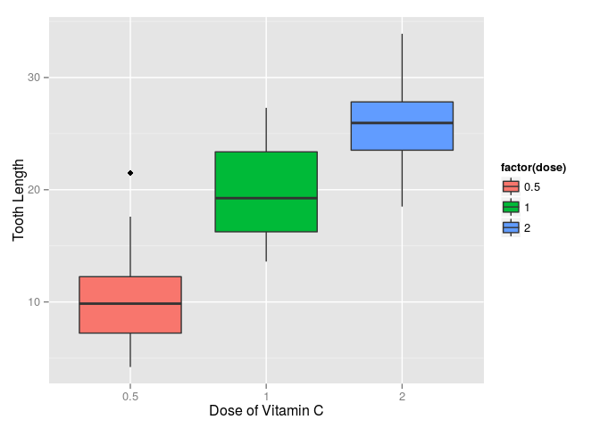
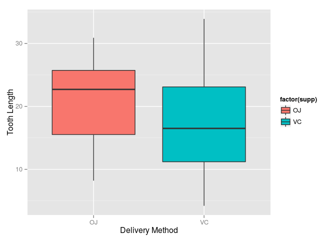
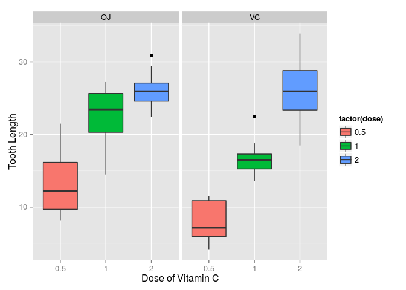

# Statistical Inference Tooth Growth
maverix13  
September 27, 2015  

#Synopsis

This document analyzes the ToothGrowth data in the R datasets package. Following step are performed for statistical inference. 

1. Load the ToothGrowth data and perform some basic exploratory data analyses 
2. Provide a basic summary of the data.
3. Use confidence intervals and/or hypothesis tests to compare tooth growth by supp and dose.
4. State your conclusions and the assumptions needed for your conclusions. 

# Load Tooth Growth Data

```r
library(ggplot2)

data("ToothGrowth")
summary(ToothGrowth)
```

```
##       len        supp         dose      
##  Min.   : 4.20   OJ:30   Min.   :0.500  
##  1st Qu.:13.07   VC:30   1st Qu.:0.500  
##  Median :19.25           Median :1.000  
##  Mean   :18.81           Mean   :1.167  
##  3rd Qu.:25.27           3rd Qu.:2.000  
##  Max.   :33.90           Max.   :2.000
```

```r
unique(ToothGrowth$dose)
```

```
## [1] 0.5 1.0 2.0
```

```r
unique(ToothGrowth$supp)
```

```
## [1] VC OJ
## Levels: OJ VC
```

The response is the length of odontoblasts (teeth) in each of 10 guinea pigs at each of three dose levels of Vitamin C (0.5, 1, and 2 mg) with each of two delivery methods (orange juice or ascorbic acid).

# Exploratory Data Analysis

### Examine tooth length against three dose levels of Vitamin C


```r
ggplot(aes(x = factor(dose), y = len), data = ToothGrowth) + 
  geom_boxplot(aes(fill = factor(dose))) + xlab("Dose of Vitamin C") + ylab("Tooth Length")
```

 

As the above plot shows, there is a clear relation between lenth of teeth with the dose levels of vitamin C. The higher dosage resulted in more tooth length.

### Examine tooth length against delivery methods


```r
ggplot(aes(x = factor(supp), y = len), data = ToothGrowth) + 
  geom_boxplot(aes(fill = factor(supp))) + xlab("Delivery Method") + ylab("Tooth Length")
```

 

Even though there is an overlap but OJ appears to be marginally better.

### Examine tooth length against dose levels of Vitamin C faceted by delivery method


```r
ggplot(ToothGrowth, aes(x=factor(dose),y=len,fill=factor(dose))) +
  geom_boxplot() + facet_grid(.~supp) + 
  scale_x_discrete("Dose of Vitamin C") + 
  scale_y_continuous("Tooth Length") 
```

 

OJ is a better delivery method when dosage levels are 0.5 and 1 mg but does not show any improvement for 2 mg dose.

# Data Summary

Summary of data, along with unique values for Vitamin C dose and delivery method are shown in load section.


```r
table(ToothGrowth$dose, ToothGrowth$supp)
```

```
##      
##       OJ VC
##   0.5 10 10
##   1   10 10
##   2   10 10
```

```r
str(ToothGrowth)
```

```
## 'data.frame':	60 obs. of  3 variables:
##  $ len : num  4.2 11.5 7.3 5.8 6.4 10 11.2 11.2 5.2 7 ...
##  $ supp: Factor w/ 2 levels "OJ","VC": 2 2 2 2 2 2 2 2 2 2 ...
##  $ dose: num  0.5 0.5 0.5 0.5 0.5 0.5 0.5 0.5 0.5 0.5 ...
```

Data consists of 60 records with 30 each for delivery method and 10 each for each dosage level for each delivery method.

# Confidence Intervals and Hypothesis

Based on the exploratory data analysis, we already saw that increase in the dose level results in larger tooth length. While delivery method does not provide any significant difference overall, but at lower dosage level OJ provided a better performance. Hence, the tests in the section will compare: 

1. Delivery Method as a factor
2. Dosage as a factor
3. Delivery Method as a factor for each dosage level

### Delivery Method as a factor


```r
t.test(len ~ supp, paired = F, data = ToothGrowth)
```

```
## 
## 	Welch Two Sample t-test
## 
## data:  len by supp
## t = 1.9153, df = 55.309, p-value = 0.06063
## alternative hypothesis: true difference in means is not equal to 0
## 95 percent confidence interval:
##  -0.1710156  7.5710156
## sample estimates:
## mean in group OJ mean in group VC 
##         20.66333         16.96333
```

With a confidence interval of [-0.1710156  7.5710156] which contains 0 results in not denying null hypothesis. 

### Dosage as a factor


```r
dose51 <- subset(ToothGrowth, dose %in% c(0.5, 1.0))
dose52 <- subset(ToothGrowth, dose %in% c(0.5, 2.0))
dose12 <- subset(ToothGrowth, dose %in% c(1.0, 2.0))
t.test(len ~ dose, paired = F, data = dose51)
```

```
## 
## 	Welch Two Sample t-test
## 
## data:  len by dose
## t = -6.4766, df = 37.986, p-value = 1.268e-07
## alternative hypothesis: true difference in means is not equal to 0
## 95 percent confidence interval:
##  -11.983781  -6.276219
## sample estimates:
## mean in group 0.5   mean in group 1 
##            10.605            19.735
```

```r
t.test(len ~ dose, paired = F, data = dose52)
```

```
## 
## 	Welch Two Sample t-test
## 
## data:  len by dose
## t = -11.799, df = 36.883, p-value = 4.398e-14
## alternative hypothesis: true difference in means is not equal to 0
## 95 percent confidence interval:
##  -18.15617 -12.83383
## sample estimates:
## mean in group 0.5   mean in group 2 
##            10.605            26.100
```

```r
t.test(len ~ dose, paired = F, data = dose12)
```

```
## 
## 	Welch Two Sample t-test
## 
## data:  len by dose
## t = -4.9005, df = 37.101, p-value = 1.906e-05
## alternative hypothesis: true difference in means is not equal to 0
## 95 percent confidence interval:
##  -8.996481 -3.733519
## sample estimates:
## mean in group 1 mean in group 2 
##          19.735          26.100
```

The confidence interval for each of the cases above allows rejection of null hypothesis.

### Delivery Method as a factor for each dosage level


```r
dose5 <- subset(ToothGrowth, dose == 0.5)
dose1 <- subset(ToothGrowth, dose == 1.0)
dose2 <- subset(ToothGrowth, dose == 2.0)
t.test(len ~ supp, paired = F, data = dose5)
```

```
## 
## 	Welch Two Sample t-test
## 
## data:  len by supp
## t = 3.1697, df = 14.969, p-value = 0.006359
## alternative hypothesis: true difference in means is not equal to 0
## 95 percent confidence interval:
##  1.719057 8.780943
## sample estimates:
## mean in group OJ mean in group VC 
##            13.23             7.98
```

```r
t.test(len ~ supp, paired = F, data = dose1)
```

```
## 
## 	Welch Two Sample t-test
## 
## data:  len by supp
## t = 4.0328, df = 15.358, p-value = 0.001038
## alternative hypothesis: true difference in means is not equal to 0
## 95 percent confidence interval:
##  2.802148 9.057852
## sample estimates:
## mean in group OJ mean in group VC 
##            22.70            16.77
```

```r
t.test(len ~ supp, paired = F, data = dose2)
```

```
## 
## 	Welch Two Sample t-test
## 
## data:  len by supp
## t = -0.046136, df = 14.04, p-value = 0.9639
## alternative hypothesis: true difference in means is not equal to 0
## 95 percent confidence interval:
##  -3.79807  3.63807
## sample estimates:
## mean in group OJ mean in group VC 
##            26.06            26.14
```

Based on confidence intervals above, we can see that for 0.5 mg ([1.719057, 8.780943]) and 1 mg ([2.802148, 9.057852]) allows us to reject null hypothesis. But at 2 mg ([-3.79807, 3.63807]) interval contains 0 not allowing us to reject the hypothesis.

# Conclusions and Assumptions

Based on the confidence interval analysis above, from the data it can be concluded that dose level of vitamin C has a correlation on tooth length with 2 mg having higher impact than 1 mg which in turn has higher impact that 0.5 mg. 

Also, we can conclude that delivery method does not provide an overall impact. But for lower dosage (0.5 mg and 1 mg) OJ had a higher impact on tooth length while 2 mg dosage delivery method has no impact.

It was assumed that population assignment of the subjects was randomized across delivery methods and dosage so that equal variances can be used. 
