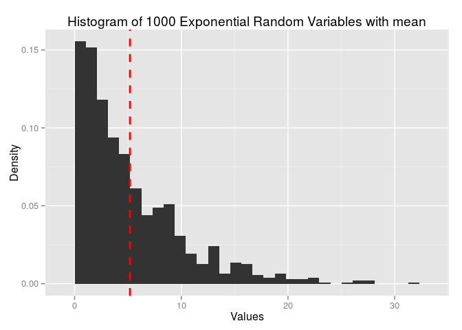

# Statistical Inference Using Exponential Distribution
maverix13  
September 27, 2015  

#Overview 
This report investigates exponential distribution in R to demonstrate comparison with Central Limit Theorem. In this report, comparison is provided for mean, variance and mean distribution to compare simulated data with that of theoretical computations. Finally, a comparison of the distribution of a large collection of random exponentials and the distribution of a large collection of averages of 40 exponentials is presented.

#Simulation
The exponential distribution can be simulated in R with rexp(n, lambda) where lambda is the rate parameter. The mean of exponential distribution is 1/lambda and the standard deviation is also 1/lambda. Lambda is set to  0.2 for all of the simulations. Investigation is done on the distribution of averages of 40 exponentials and a total of 1000 simulations are executed.


```r
library(ggplot2)
set.seed(123)
lambda <- 0.2
n <- 40
numSimulations <- 1000
simulatedMeans <- NULL
for (i in 1:numSimulations) simulatedMeans = c(simulatedMeans, mean(rexp(40, lambda)))
values <- rexp(1000, lambda)
ggplot(data.frame(values), aes(x=values)) +
  geom_histogram(aes(y=..density..)) +
  stat_function(fun = dexp, args=list(mean=5, sd=5), colour = "red") +
  xlab("Values") + ylab("Density") +
  geom_vline(aes(xintercept=mean(values)), color="red", linetype="dashed", size=1) +
  ggtitle("Histogram of 1000 Exponential Random Variables with mean")
```

```
## stat_bin: binwidth defaulted to range/30. Use 'binwidth = x' to adjust this.
```

 

#Sample Mean versus Theoretical Mean
This section compares the simulated mean with theoretical mean. The mean of exponential distribution is 1/lambda.


```r
theoreticalMean <- 1/lambda # Value is 5
simulatedMean <- mean(simulatedMeans)
```
In comparison to theoretical mean 5, simulated mean is centered at 5.0119113


```r
df <- data.frame(simulatedMeans)
colnames(df) <- c("MeanValue")
ggplot(df, aes(x=MeanValue)) + ggtitle("Averages of Exponential Random Variables") +
  geom_histogram(aes(y=..density..)) + 
  geom_vline(aes(xintercept=simulatedMean), color="red", linetype="dashed", size=1) +
  geom_density(alpha=.2, fill="#FF6666")
```

```
## stat_bin: binwidth defaulted to range/30. Use 'binwidth = x' to adjust this.
```

 

#Sample Variance versus Theoretical Variance
The standard deviation of expoenetial distribution is also 1/lambda.
According to Central Limit theorem, one useful way to think about is that sample average is approximately normally distributed with N(mu, sigma^2/n) where mu and sigma are theoretical mean and standard deviation.

```r
theoreticalVar <- (1/lambda)^2
simulatedVar <- var(simulatedMeans) * n
```

In comparison to theoretical variance 25, simulated variance of the distribution is 24.0197135.
According to CLT, as the number of simulation increases the sample averages should approach to normal distribution with mean and standard deviation close to theoretical values. Based on the previous statement, conclusion can be drawn that instead of 1000 simulations, if there are million simulations simulated and theoretical variance should be close to each other.

#Distribution
Figure in the Simulation section shows the distribution of 100 random exponential variables along with the mean. That figure follows a exponential curve for the random variables. 

While the figure titled "Averages of Exponential Distribution" follows a normal distribution with highest density near mean. According to CLT, mean of the samples which it itself a random variable can be used to approximate the mean of underlying distribition. Further more, comparison of means and variance based on theoretical and simulated data provides us the essence of CLT. Also, as the number of simulations increase, averages distribution of underlying probability function will become close to normal distribution with highest density centered at mean. 
